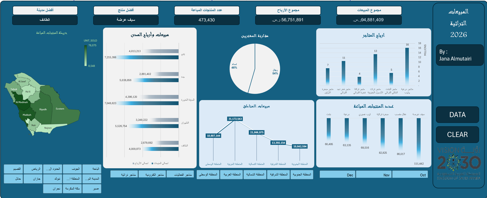

# Excel Sales Dashboard

An interactive Microsoft Excel dashboard developed to analyze fictional 2026 sales data and provide a clear overview of sales performance, profitability, products, stores, and regional trends.

## Dashboard Preview

## Key Insights

- Overview of total sales and total profit.
- Analysis of sales and profit across different cities.
- Comparison of sales performance across Saudi regions.
- Identification of top-performing products.
- Analysis of product quantities sold.
- Comparison of store profitability.
- Customer distribution by gender.
- Geographic visualization of units sold across Saudi Arabia.

## Dashboard Features

- Sales and profit KPI cards
- Interactive PivotTables and PivotCharts
- Geographic sales visualization
- Product and store performance analysis
- Regional and city-level analysis
- Interactive slicers for filtering dashboard results
- Clear filter functionality

## Tools & Techniques

- Microsoft Excel
- PivotTables
- PivotCharts
- Interactive Slicers
- Excel Charts
- Data Analysis
- Data Visualization
- VBA / Macros

## Project Files

The repository includes the original Excel `.xlsm` workbook containing the dashboard and its interactive components.

## Note

This dashboard was created for **training and learning purposes using fictional data**. It does not represent actual business, customer, or organizational data.
